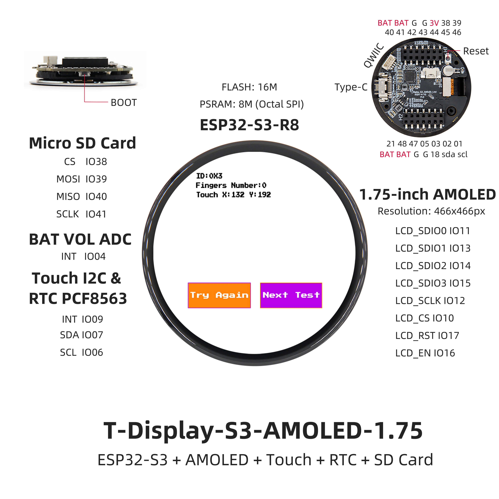
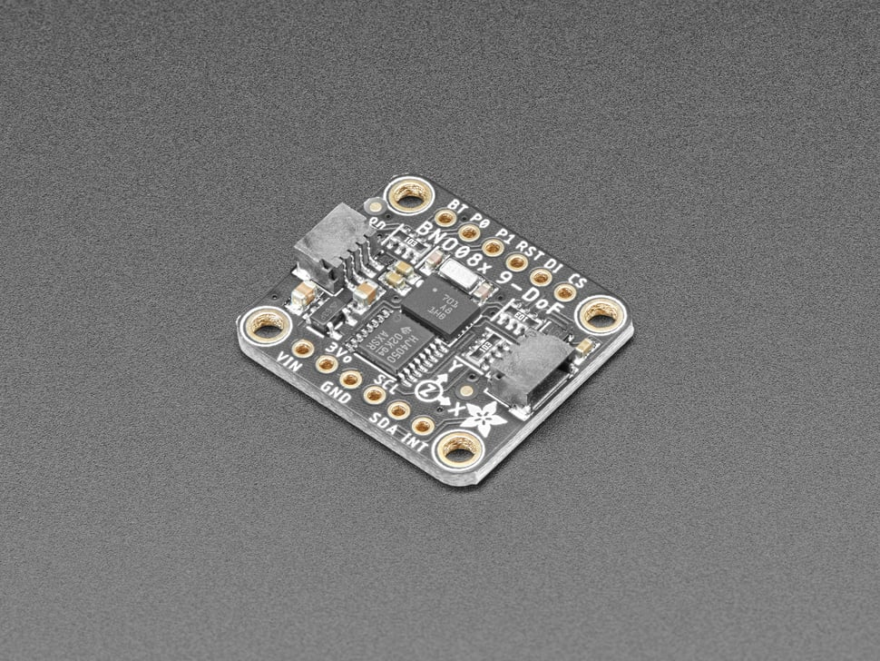
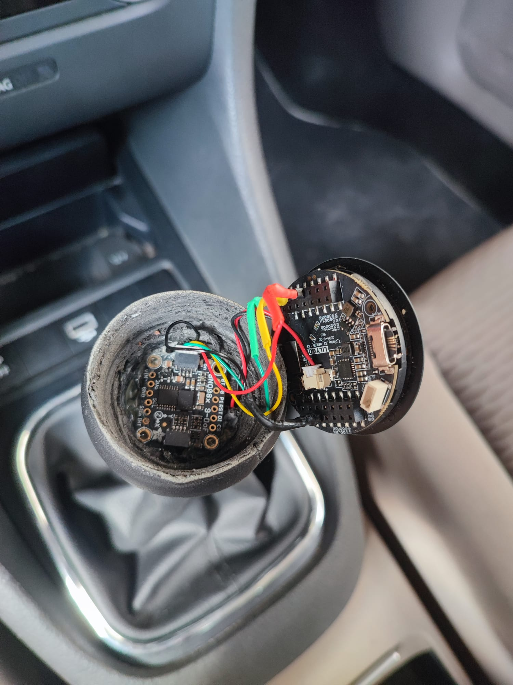
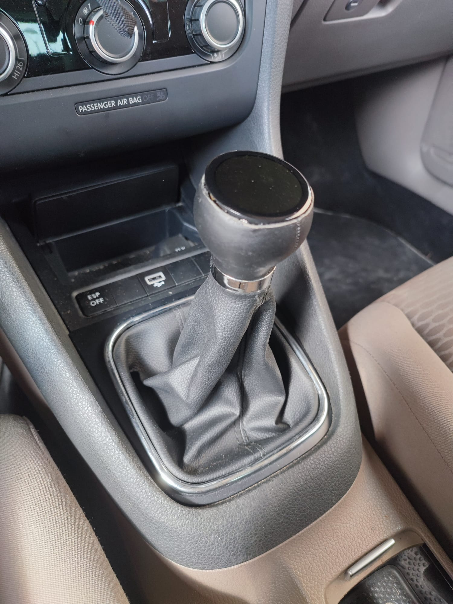
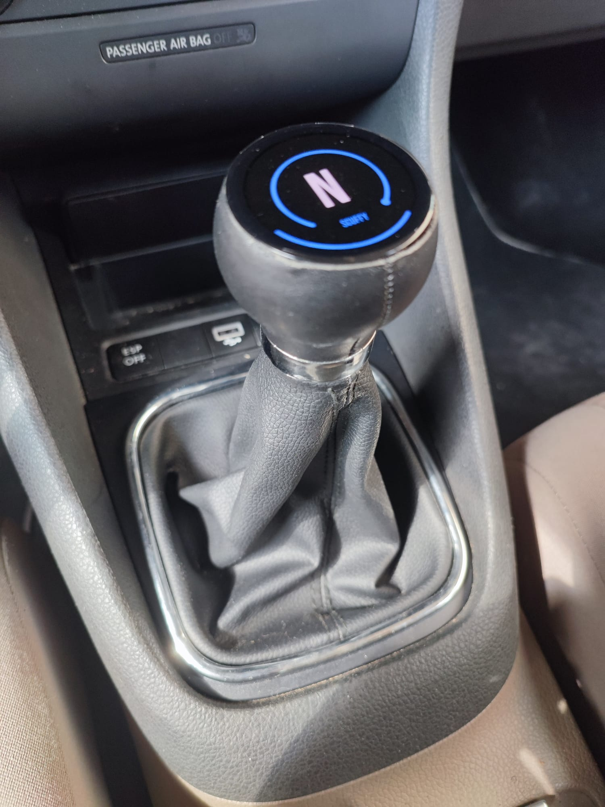
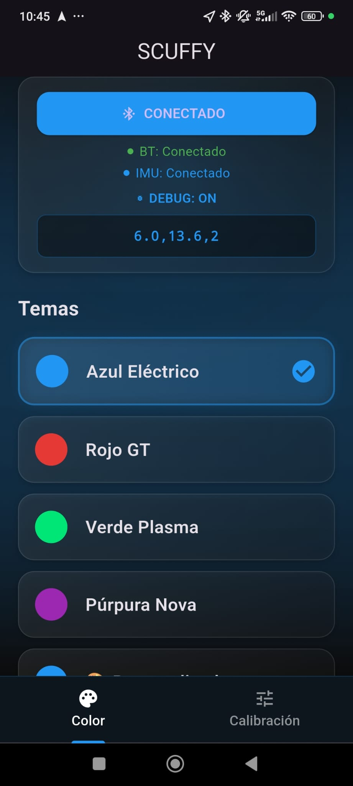
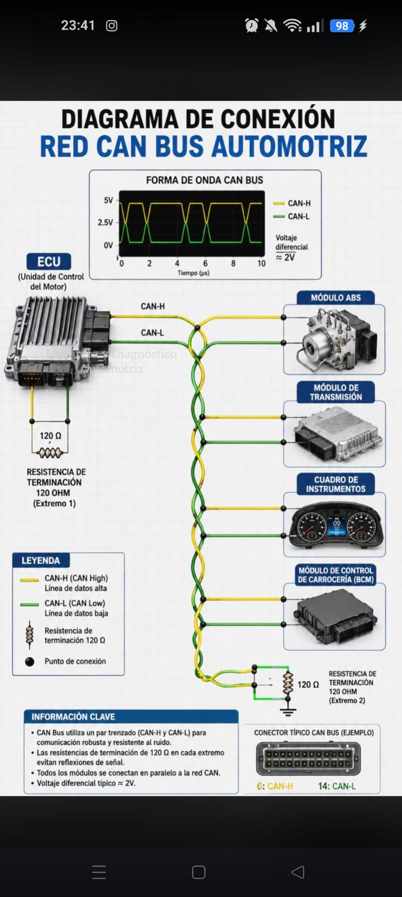

# Digital Gear Knob

**Read this in Spanish → [README_ES.md](README_ES.md)**

I created this digital gear indicator from scratch — hardware, firmware, and app. An ESP32-S3 mounted on the gear stick reads the stick's 3D orientation from a BNO085 IMU, detects which of the seven gear positions (R, 1–5, N) the driver selected, and shows it on an AMOLED display with an LVGL animated arc. The same device exposes a Bluetooth Low Energy service that a Flutter companion app ("scuffy") uses for live debugging, theming, and calibration.

## How to use it

Using it takes three simple steps:

1. **Mount the knob** on the gear stick — the electronics live inside the knob, so there is nothing else to install in the car.
2. **Start the car** — the display turns on and shows the selected gear automatically. The neutral reference is captured at boot, so no setup is needed.
3. **Connect the phone app** (optional) — scan for the device advertised as `SCUFFY` to change the accent color, calibrate the gears, or watch live debug values.

That's it — no dashboard wiring, no configuration. The knob detects the gear from the stick's orientation and shows it on the screen.

## Key Features

- **7-gear H-pattern detection** (R, 1–5, N) from a single 9-DOF IMU mounted on the lever.
- **AMOLED display with LVGL arc animation** — the selected gear is shown with a 2-second "loading" arc animation instead of a hard value jump.
- **BLE connectivity to a Flutter app** — the app can connect, stream data, change the accent color, and run per-gear calibration.
- **Live BLE debug mode** — sending `debug:on` makes the device notify `debug:ROLL,PITCH,GEAR` on every detection cycle, so thresholds can be tuned in real time.
- **Automatic neutral-reference recapture for slope compensation** — if the lever stays near neutral, the reference quaternion is re-captured, re-centering the whole coordinate system when the car's slope changes.
- **Boot-neutral calibration** — the neutral reference is captured from the first sensor reading after boot, so no manual setup is required.

## Architecture Overview

```
┌────────────────────────────────────────────────────────────────┐
│                    ESP32-S3 · T-Display S3                     │
│                    C++ / Arduino / PlatformIO                  │
│                                                                │
│  ┌──────────┐   I2C (100 kHz)   ┌─────────────┐                │
│  │  BNO085  │ ─────────────────▶│  gears      │                │
│  │  IMU     │   rotation vector │  (detection │                │
│  └──────────┘   SH2_RV @ 200 Hz │   + zones)  │                │
│                                  └──────┬──────┘               │
│                                         │ LVGL 8.3.11          │
│                                         ▼                      │
│                                  ┌──────────────┐              │
│                                  │ 1.43" AMOLED │              │
│                                  │ arc + gear   │              │
│                                  └──────────────┘              │
│                                         │                      │
│                                    NimBLE "SCUFFY"             │
└────────────────────────────────────────┬───────────────────────┘
                                         │ BLE
                                         ▼
                               ┌────────────────────┐
                               │  Flutter app        │
                               │  "scuffy"           │
                               │  flutter_blue_plus  │
                               │  scan · connect ·   │
                               │  debug · calibrate  │
                               └────────────────────┘
```

Two data paths meet on the board: the sensor quaternion flows in over I2C, is turned into a gear by the detection logic, and is rendered on the AMOLED via LVGL; in parallel, the same board runs a NimBLE GATT server so the phone app can observe and configure it.

## Components

### ESP32-S3 T-Display AMOLED



**Technologies:** ESP32-S3 (dual-core, 240 MHz) · Wi-Fi/BLE · 1.43" AMOLED · QSPI · LVGL 8.3.11

The brain and the screen in one. This LilyGO T-Display S3 board runs the whole firmware — BNO085 fusion handling, gear detection, LVGL rendering, and the BLE server — and its 1.43" AMOLED shows the current gear with the animated loading arc. The firmware also supports other AMOLED panels of the same board family; the active panel is selected with a define in `include/pin_config.h`.

### BNO085 9-DOF IMU



**Technologies:** Adafruit BNO085 breakout · accelerometer + gyroscope + magnetometer · on-chip sensor fusion (rotation vector) · I2C/SPI · STEMMA QT / Qwiic

A 9-DOF IMU with an on-board fusion engine. Instead of fusing raw accel/gyro/mag data on the MCU, the BNO085 produces a filtered rotation vector (quaternion) internally, which is both more accurate and simpler to use. It is mounted on the gear stick so its orientation mirrors the stick's position. The firmware reads it over I2C at 100 kHz with the rotation-vector report enabled at a 5 ms interval, while the detection loop samples it at 5 Hz (every 200 ms) and applies a stability check.

### Gear knob


The physical knob that replaces the stock one. The IMU is embedded inside the knob, which is the mechanical integration of the whole project into the car: power and electronics live inside the knob, and the display faces the driver.

#### Assembly

The open view shows the BNO085 and the ESP32-S3 wired inside the knob before they are glued in place; the final product keeps the display facing the driver, showing the current gear when powered on.

  

### Flutter app (scuffy)



**Technologies:** Flutter · Dart · flutter_blue_plus · permission_handler · shared_preferences

The BLE client companion app. It scans for the device (advertised as `SCUFFY`), connects to the command characteristic, and exposes the live debug values (roll, pitch, detected gear) in a panel when the DEBUG toggle is on. It also lets the user change the display accent color and run per-gear calibration from the phone.

## How It Works

### Detection algorithm

1. **Capture the neutral reference.** On the first valid sensor reading after boot (the lever is in N at that point), the raw quaternion is stored as `q_neutral`.
2. **Compute the relative rotation.** Each new sample is expressed relative to neutral: `q_rel = conj(q_neutral) * q_current`. This removes the absolute mounting orientation and leaves only the stick's movement.
3. **Extract tilt angles.** `q_rel` is decomposed into two angles in degrees: **pitch** (forward/backward tilt) and **roll** (left/right tilt). This is what separates the columns and rows of the H-pattern.
4. **Map to 2D zones.** The H-pattern splits along pitch: forward gears have `pitch < 0`, reverse and even gears have `pitch > 0`. Roll then separates R / 1 / 3 / 5 in the forward row and 4 / 2 in the reverse row. Neutral is a small dead zone around the center.
5. **Debounce with a stability counter.** A gear change is only accepted after **3 consecutive identical detections** (detection runs every 200 ms), which rejects transient readings while the stick is mid-shift.
6. **Animate the arc.** On acceptance, a 2-second ease-in-out LVGL arc animation plays toward the target value while the label shows the target gear the whole time — it never counts through intermediate gears on the way down (no N-5-4-3-2-1 flicker).

### Auto-recapture of neutral (slope compensation)

The BNO085 measures absolute orientation against gravity. If the car's slope changes, the neutral reference captured at boot no longer matches the actual lever position, and every gear reads wrong.

The fix is to re-capture the reference at runtime: whenever the lever sits **within ±8° of neutral for ~1 s**, the firmware re-captures `q_neutral` as the normalized average of the samples taken in that window. Because the zones are defined as displacements relative to N, re-centering N re-centers the whole system.

There is a critical safety gate: recapture only triggers when the *detected* gear is N or ambiguous. Without it, 5th gear (pitch −9.2°) would enter the ±8° window on a modest slope and corrupt the neutral reference while driving.

**Known limitation.** With a single IMU on the lever, sustained slope offsets beyond ~3° cannot be fully distinguished from a real gear position — a slope of that magnitude shifts every zone by the same amount. The planned fix is to read the gear directly from the car's CAN bus, which removes this limitation entirely (see [Improvements](#improvements)).

## Tech Stack

| Layer | Technology |
| --- | --- |
| Firmware | C++ · Arduino framework · PlatformIO |
| MCU | ESP32-S3 (LilyGO T-Display S3), dual-core 240 MHz |
| Sensor | Adafruit BNO085 (on-chip rotation vector) · I2C 100 kHz |
| Display | 1.43" AMOLED · LVGL 8.3.11 · GFX Library for Arduino 1.4.9 |
| BLE (firmware) | NimBLE-Arduino ^1.4.1 |
| App | Flutter · Dart |
| BLE (app) | flutter_blue_plus ^1.35.5 |
| App support | permission_handler ^12.0.1 · flutter_colorpicker ^1.1.0 · shared_preferences ^2.2.0 |

## Project Structure

```
ChatGPT/
├── DigitalGearKnob/            # ESP32-S3 firmware (PlatformIO)
│   ├── platformio.ini          # envs: lilygo-t-display-s3, native (host tests)
│   ├── include/
│   │   ├── pin_config.h        # pin mapping + AMOLED panel selection
│   │   └── lgfx_user.hpp       # LGFX configuration
│   ├── src/
│   │   ├── main.cpp            # boot sequence + main loop
│   │   ├── display/            # QSPI AMOLED init (GFX library)
│   │   ├── lvgl_port/          # LVGL ↔ display integration
│   │   ├── ui/                 # SquareLine-generated LVGL screens (arc + gear label)
│   │   ├── boot/               # logo splash + fade into the gear screen
│   │   ├── theme/              # accent color / theming
│   │   ├── bno/                # BNO085 driver + I2C bus recovery
│   │   ├── gears/              # gear detection, neutral recapture, arc animation
│   │   ├── ble/                # NimBLE GATT server + debug mode
│   │   └── calibration/        # gear enum + calibration persistence (NVS)
│   └── test/test_calibration/  # host-side Unity tests for the calibration module
├── scuffy/                     # Flutter companion app
│   └── lib/
│       ├── services/ble_service.dart   # BLE client singleton (scan, notify, commands)
│       ├── screens/                    # home, gear calibration, splash
│       ├── widgets/                    # gear card, theme card, status UI
│       ├── models/                     # gear, quaternion, theme, calibration state
│       └── data/                       # theme presets
├── images/                         # product images used by this README
```

## Calibration

The current detection zones were calibrated with real measurements taken inside the car, and the zone thresholds in `gears.cpp` come directly from those measurements:

| Gear | Zone (relative to neutral, in degrees) |
| --- | --- |
| N | `|roll| < 2.5` and `|pitch| < 2.5` |
| R | `pitch < -3` and `roll > 18` |
| 1 | `pitch < -3` and `12 < roll <= 18` |
| 3 | `pitch < -3` and `7 < roll <= 12` |
| 5 | `pitch < -3` and `roll <= 7` |
| 4 | `pitch > 3` and `roll < -7.5` |
| 2 | `pitch > 3` and `roll >= -7.5` |

Measured anchor points from the car: R (20.4, −4.7), 1 (13.6, −9.7), 3 (10.0, −13.5), 5 (1.6, −9.2), N (0.9, 0.9), 2 (−5.1, 14.8), 4 (−9.6, 11.1) — shown as `(roll, pitch)`.

## Future Improvements

**Reading the gear directly from the car's CAN bus (CAN_L / CAN_H).** My next step is to replace the BNO085-based detection with a direct read from the vehicle's CAN bus: instead of inferring the gear from the stick's orientation, the car itself reports which gear is engaged. This removes the entire sensor-fusion path — no calibration, no slope compensation, and no ~3° limitation — because the reading comes straight from the vehicle.

**And the display unlocks much more than the gear.** The AMOLED is already there — connecting to the CAN bus turns it into a real dashboard on the stick. The car broadcasts dozens of live signals, and the knob can render any of them on the 1.43" screen:

- **Speed and engine RPM** — real-time values on the stick, no need to look away from the road.
- **Engine coolant temperature** — an early warning for overheating.
- **Fuel level** — remaining range at a glance.
- **Battery voltage** — alternator health without extra sensors.
- **Odometer / trip data** — where the car has been and how far.

The gear becomes just one channel among many; the same knob, display, and BLE link already built for this project can present the whole vehicle. The image below shows the kind of data that is available over CAN:



Other planned improvements:
- **Dedicated `gear:X` BLE notification** so the phone app can display the current gear without debug mode or polling.
- **Guided in-app calibration wizard** — a structured flow around the existing per-gear capture.
- **Host-side unit tests for the zone logic** — extend the native test harness from calibration to the 2D gear detection.

## License

This project is licensed under the [MIT License](LICENSE).
