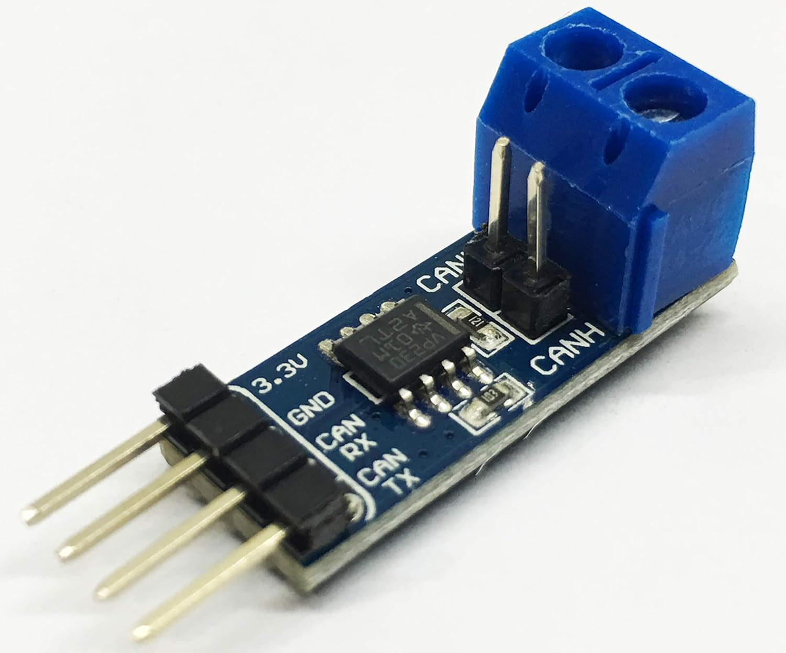

# Indicador de Marchas Digital (Digital Gear Knob)

**Leer en inglés → [README.md](README.md)**

He creado este indicador digital de marchas desde cero — hardware, firmware y app. Un ESP32-S3 montado en la palanca de cambios lee la marcha seleccionada directamente del bus CAN del coche — la red de transmisión del coche — a través de un transceptor Waveshare SN65HVD230, y lo muestra en una pantalla AMOLED con una animación de arco realizada en LVGL. El mismo dispositivo expone un servicio Bluetooth Low Energy que una app complementaria en Flutter ("scuffy") utiliza para depuración en vivo, sniffer de CAN y personalización de tema.

## Características principales

- **Detección de las 7 marchas** (R, 1–5, N) leída directamente del bus CAN de transmisión del coche — sin sensor en la palanca y sin calibración.
- **Pantalla AMOLED con animación de arco en LVGL** — la marcha seleccionada se muestra con una animación de "carga" de 2 segundos en lugar de un cambio brusco de valor.
- **Conectividad BLE con una app Flutter** — la app muestra el estado del CAN y la marcha actual, cambia el color de acento y activa/desactiva el modo sniff.
- **Modo de depuración BLE en vivo** — enviando `debug:on` el dispositivo notifica `debug:<GEAR>,<RPM>,<SPEED>,<CANSTAT>` en cada ciclo de detección.
- **Modo sniff CAN para ingeniería inversa** — `sniff:on` vuelca tramas limitadas en frecuencia (ID + payload) por BLE y Serial, de modo que el layout de las tramas pueda confirmarse antes de configurarlo.
- **Solo escucha por diseño** — el controlador TWAI está fijado en modo listen-only sin ningún camino de transmisión; un nodo que solo escucha jamás puede perturbar el bus del vehículo.

## Visión general de la arquitectura

```
┌────────────────────────────────────────────────────────────────┐
│                    ESP32-S3 · T-Display S3                     │
│                    C++ / Arduino / PlatformIO                  │
│                                                                │
│  ┌──────────────┐   TWAI · listen-only  ┌─────────────┐        │
│  │ SN65HVD230   │ ─────────────────────▶│  gears      │        │
│  │ CAN trans-   │   500 kbps · GPIO 3/5 │  (ratio     │        │
│  │ ceiver       │   RX only             │  estimator) │        │
│  └──────▲───────┘                       └──────┬──────┘        │
│         │                                      │ LVGL 8.3.11   │
│         │                                      ▼               │
│         │                               ┌──────────────┐       │
│         │                               │ 1.43" AMOLED │       │
│         │                               │ arc + marcha │       │
│         │                               └──────────────┘       │
│         │                                      │               │
│         │                                 NimBLE "SCUFFY"      │
└─────────┼───────────────────────────────────────┬──────────────┘
          │ CAN_H / CAN_L (bus de transmisión)    │ BLE
          ▼                                       ▼
┌───────────────────────────┐            ┌────────────────────┐
│ El bus CAN del coche      │            │  App Flutter        │
│ 500 kbps · IDs de 29 bits │            │  "scuffy"           │
│ derivación (solo escucha) │            │  flutter_blue_plus  │
└───────────────────────────┘            │  scan · connect ·   │
                                         │  sniff · debug ·    │
                                         │  tema               │
                                         └────────────────────┘
```

En la placa convergen dos flujos de datos: las tramas del bus CAN de transmisión del vehículo llegan a través del transceptor SN65HVD230, la lógica de detección las convierte en marcha mediante el estimador de relaciones y se renderiza en la AMOLED mediante LVGL; en paralelo, la misma placa ejecuta un servidor GATT NimBLE para que la app del teléfono pueda observar, hacer sniff y configurar el dispositivo.

## Componentes

### ESP32-S3 T-Display AMOLED


**Tecnologías:** ESP32-S3 (doble núcleo, 240 MHz) · Wi-Fi/BLE · AMOLED de 1.43" · QSPI · LVGL 8.3.11

El cerebro y la pantalla en una sola placa. Esta placa LilyGO T-Display S3 ejecuta todo el firmware — recepción y decodificación del CAN, detección de marcha, renderizado LVGL y el servidor BLE — y su AMOLED de 1.43" muestra la marcha actual con el arco animado de carga. El firmware también soporta otras pantallas AMOLED de la misma familia de placas; el panel activo se selecciona con un `define` en `include/pin_config.h`.

### Transceptor CAN SN65HVD230



**Tecnologías:** breakout Waveshare SN65HVD230 · transceptor CAN 2.0B · lógica de 3.3 V · terminación de 120 Ω integrada (jumper, deshabilitado para la conexión al vehículo)

El puente entre el coche y el pomo. El CAN es un bus diferencial de dos hilos (CAN_H / CAN_L); el SN65HVD230 lo convierte a los niveles lógicos de 3.3 V que puede leer el controlador TWAI integrado del ESP32-S3. Se conecta al bus de transmisión del coche — la red que transporta las señales de RPM y velocidad de rueda que necesita la detección de marcha.

#### Conexión

El transceptor se conecta directamente a los pines del ESP32-S3:

| SN65HVD230  | ESP32-S3    | Función                        |
| ----------- | ----------- | ------------------------------ |
| **VCC**     | **3.3V**    | Alimentación                   |
| **GND**     | **GND**     | Masa                           |
| **TXD**     | **GPIO 3**  | TWAI TX (nunca se activa — solo escucha) |
| **RXD**     | **GPIO 5**  | TWAI RX                        |
| **CANH**    | Pin OBD-II 6 (CAN_H) | Línea alta del bus      |
| **CANL**    | Pin OBD-II 14 (CAN_L) | Línea baja del bus      |

> **Seguridad: solo escucha y terminación.** El firmware inicia TWAI en modo listen-only y no expone ningún camino de transmisión — el pomo jamás puede escribir en el bus del coche. El jumper de terminación de 120 Ω de la placa Waveshare debe estar **deshabilitado** para la conexión al vehículo: el bus de transmisión ya está terminado en ambos extremos, y un tercer 120 Ω en paralelo bajaría el bus a ~40 Ω y arriesgaría fallos de comunicación en todo el coche. (Las pruebas de banco sobre un mini-bus aislado pueden mantenerlo.)

#### Selección del bus CAN

Un coche puede llevar varios buses CAN independientes a distinta velocidad. En esta generación de VW la red se divide en tres:

| Bus | Velocidad | Qué lleva | ¿Usarlo? |
| --- | --- | --- | --- |
| **Bus de transmisión** (Antriebs-CAN) | 500 kbps | Motor (RPM), ABS (velocidad de rueda), gateway | ✅ — conectar aquí |
| **Convenience-CAN** | 100 kbps | Puertas, cierre centralizado, ventanillas | ❌ |
| **Infotainment-CAN** | 100 kbps | Radio, navegación | ❌ |

El bus de transmisión es el que transporta las señales de RPM y velocidad de rueda que necesita el estimador de relaciones. El punto de conexión más fácil es el **conector de diagnóstico OBD-II** bajo el tablero — en esta generación el bus de transmisión llega directamente hasta él:

| Pin OBD-II | Señal | Color típico |
| --- | --- | --- |
| **6** | CAN-H (transmisión) | naranja/negro |
| **14** | CAN-L | naranja/marrón |

Una derivación de dos hilos en los pines 6 y 14 no requiere empalmar el arnés y es totalmente reversible. Confirma con el modo sniff que las tramas realmente fluyen — en algunos modelos el conector está detrás de una gateway que filtra las tramas en bruto; en ese caso recurre a empalmar el par de transmisión directamente en el conector del motor o de la centralita ABS.

Colores de cable típicos en los pares de transmisión de VW (verifícalo con un multímetro):

| Señal | Color típico |
| --- | --- |
| CAN-H (transmisión) | naranja/negro |
| CAN-H (conveniencia) | naranja/verde |
| CAN-H (infotainment) | naranja/violeta |
| CAN-L (todos los buses) | naranja/marrón |

**Comprobación con multímetro:** ambos hilos reposan en ~2.5 V; el CAN-H sube a ~3.5 V y el CAN-L baja a ~1.5 V cuando hay tramas activas.

> **Nunca alimentes desde el pin 16 del OBD.** Lleva +12 V permanente de la batería — alimentar el pomo desde ahí drena la batería al estacionar. Mantén la alimentación propia del pomo.

> **El propio firmware confirma el par correcto.** Escucha a 500 kbps fijos, así que si te conectas al bus equivocado verás `can:no_frames` (o errores de bus) en la pantalla de sniff en lugar de tramas — un par incorrecto se hace evidente en lugar de desconcertante.

#### Qué puede mostrar cada bus

| Bus | Señales disponibles para la pantalla |
| --- | --- |
| **Bus de transmisión** (500 kbps) | RPM del motor · velocidad del vehículo · temperatura del refrigerante · nivel de combustible · tensión de la batería · odómetro/viaje · carga del motor · posición del acelerador · luz de marcha atrás · marcha engranada en cajas automáticas (Etapa 2, vía la ECU de la caja) |
| **Komfort-CAN** (100 kbps) | Puertas abiertas/cerradas · cierre centralizado · posición de ventanillas · estado de luces · estado de llave/encendido |
| **Infotainment-CAN** (100 kbps) | Metadatos de media (tema/emisora) · volumen · datos de navegación |

El bus de transmisión es el interesante para un pomo de marchas: además de la marcha en sí, lleva todas las señales de motor y chasis que caben en la AMOLED.

### Pomo de cambios


El pomo físico que sustituye al original. La electrónica va embebida en el interior del pomo — la placa ESP32-S3 con la pantalla y el pequeño transceptor CAN que se conecta al bus de transmisión del coche — que constituye la integración mecánica de todo el proyecto en el coche: la alimentación y la electrónica viven dentro del pomo, y la pantalla queda orientada hacia el conductor.

#### Ensamblaje

La vista abierta muestra el ESP32-S3 conectado dentro del pomo antes de pegar la electrónica (la foto es anterior al transceptor CAN de v2). El producto final mantiene la pantalla orientada hacia el conductor, mostrando la marcha actual cuando está encendido.

  

### App Flutter (scuffy)


**Tecnologías:** Flutter · Dart · flutter_blue_plus · permission_handler · shared_preferences

La app cliente BLE complementaria. Escanea el dispositivo (anunciado como `SCUFFY`), se conecta a la característica de comandos y muestra el estado del CAN y la marcha actual, con los valores de depuración (marcha, RPM, velocidad y estado del CAN) en un panel cuando el toggle de DEBUG está activado. También tiene una vista de sniff que vuelca tramas CAN en bruto para ingeniería inversa, y permite cambiar el color de acento de la pantalla. La calibración por marcha desapareció en v2 — la marcha ahora llega del propio coche.

## Cómo funciona

### Algoritmo de detección

1. **Escuchar el bus de transmisión.** El SN65HVD230 convierte el bus CAN diferencial a lógica de 3.3 V; el controlador TWAI integrado del ESP32-S3 recibe las tramas en modo listen-only a 500 kbps (GPIO 3 TX / GPIO 5 RX).
2. **Extraer RPM y velocidad de rueda.** El firmware decodifica las dos señales desde sus tramas CAN mediante un layout configurable — los IDs de trama y las posiciones de bit viven en `VehicleCanConfig` y se confirman con el modo sniff antes de entrar en producción.
3. **Calcular la relación.** En cada ciclo de detección se calcula la relación actual `RPM ÷ velocidad`.
4. **Comparar contra la tabla de relaciones de la caja.** Cada marcha tiene una banda de relación; el estimador compara la relación en vivo con la banda más cercana aplicando **histéresis** en los bordes, de modo que la pantalla no parpadee alrededor de un límite de cambio.
5. **Aplicar las reglas de punto muerto, detención y embrague.** Por debajo de una velocidad mínima el resultado es N; si la relación no cae en ninguna banda (punto muerto, embrague pisado, patinaje de rueda) el resultado es N; si las tramas dejan de llegar durante 500 ms el resultado es N — una marcha obsoleta nunca se muestra.
6. **Anti-rebote y animación del arco.** Un cambio de marcha solo se acepta tras **3 detecciones idénticas consecutivas** (la detección se ejecuta cada 200 ms), lo que descarta lecturas transitorias mientras la palanca está a medio camino. Al aceptarse, se reproduce una animación de arco LVGL de 2 segundos con easing hacia el valor objetivo, mientras la etiqueta muestra la marcha destino durante todo el proceso — nunca cuenta marchas intermedias al bajar (sin el parpadeo N-5-4-3-2-1).

### Lectura del bus CAN y modo sniff

Como la marcha se estima a partir de la relación RPM ÷ velocidad, el indicador funciona sin ningún sensor en la palanca — y sin las limitaciones de v1: sin calibración, sin compensación de pendientes y sin deriva de ángulo de montaje. Los casos límite restantes (punto muerto, embrague, patinaje) los cubren las reglas de N descritas arriba, y la marcha atrás vs. la 1ª está cerca en esta caja de cambios (ver [Tabla de relaciones de marchas](#tabla-de-relaciones-de-marchas)).

El layout de tramas del bus de transmisión del coche se confirma en el banco y en el coche con el **modo sniff**: enviando `sniff:on` por BLE (o escribiéndolo en Serial) el pomo vuelca tramas como `sniff:<E|S><id-hex-8-digitos>:<payload-hex>` en ambos canales, limitadas a 20 líneas por segundo; `sniff:off` detiene el volcado. Si no llegan tramas durante 2 segundos con el sniff activo, el pomo notifica `can:no_frames` — un bus silencioso (bitrate incorrecto, CANH/CANL invertidos o un empalme defectuoso) se hace evidente en lugar de desconcertante. La conexión tiene una regla de seguridad dedicada: el controlador solo escucha y el jumper de terminación permanece deshabilitado (ver la [sección de conexión](#transceptor-can-sn65hvd230)).

## Stack tecnológico

| Capa | Tecnología |
| --- | --- |
| Firmware | C++ · framework Arduino · PlatformIO |
| MCU | ESP32-S3 (LilyGO T-Display S3), doble núcleo 240 MHz |
| Bus CAN | Transceptor Waveshare SN65HVD230 · ESP32-S3 TWAI (solo escucha) · 500 kbps |
| Pantalla | AMOLED 1.43" · LVGL 8.3.11 · GFX Library for Arduino 1.4.9 |
| BLE (firmware) | NimBLE-Arduino ^1.4.1 |
| App | Flutter · Dart |
| BLE (app) | flutter_blue_plus ^1.35.5 |
| Soporte app | permission_handler ^12.0.1 · flutter_colorpicker ^1.1.0 · shared_preferences ^2.2.0 |

## Estructura del proyecto

```
ChatGPT/
├── DigitalGearKnob/            # Firmware ESP32-S3 (PlatformIO)
│   ├── platformio.ini          # envs: lilygo-t-display-s3, native (tests host)
│   ├── include/
│   │   ├── pin_config.h        # Mapeo de pines + selección de panel AMOLED
│   │   └── lgfx_user.hpp       # Configuración LGFX
│   ├── src/
│   │   ├── main.cpp            # Secuencia de arranque + bucle principal
│   │   ├── display/            # Init de la AMOLED QSPI (GFX library)
│   │   ├── lvgl_port/          # Integración LVGL ↔ pantalla
│   │   ├── ui/                 # Pantallas LVGL generadas con SquareLine (arco + etiqueta)
│   │   ├── boot/               # Splash de logo + fundido a la pantalla de marcha
│   │   ├── theme/              # Color de acento / theming
│   │   ├── can/                # Driver TWAI solo escucha + modo sniff
│   │   ├── geardecode/         # Tipos CAN puros, extractor de señales, estimador de relaciones
│   │   ├── gearsource/         # Glue snapshot CAN → marcha
│   │   ├── gears/              # Estado de pantalla de la marcha + animación del arco
│   │   ├── ble/                # Servidor GATT NimBLE + modo debug + drenaje de sniff
│   │   ├── calibration/        # Enum de marchas + fromString (sin NVS)
│   │   └── bno/                # Driver IMU de v1 — referencia de solo lectura, no se compila
│   └── test/                   # Tests Unity en host (env native)
│       ├── test_calibration/   # Tests de fromString + enum
│       └── test_decoder/       # Tests de estimador, señales, sniff y formato BLE
├── scuffy/                     # App complementaria Flutter
│   └── lib/
│       ├── services/ble_service.dart   # Singleton cliente BLE (scan, notify, comandos)
│       ├── screens/                    # home, sniff, splash
│       ├── widgets/                    # tarjeta de marcha, tarjeta de tema, estado UI
│       ├── models/                     # marcha, tema, mensajes BLE, sesión de sniff
│       └── data/                       # presets de tema
├── images/                         # Imágenes del producto usadas en este README
```

## Tabla de relaciones de marchas

El estimador compara la relación RPM ÷ velocidad de rueda contra una tabla por marcha en `VehicleCanConfig` — el único punto de datos específico del vehículo. Los valores por defecto provienen de las relaciones publicadas de la caja del coche, escaladas por el diferencial final y las revoluciones de rueda por km para sus neumáticos (~503.7 rev/km):

| Marcha | Relación (RPM por km/h) |
| --- | --- |
| R | 102.4 |
| 1 | 107.5 |
| 2 | 58.7 |
| 3 | 38.3 |
| 4 | 27.5 |
| 5 | 22.0 |

Cada banda es el valor central ±8%, con un tiempo de caducidad de 500 ms y una velocidad mínima de 5 km/h por debajo de la cual la relación no tiene sentido (N). Son **valores iniciales a verificar en el coche** — la marcha atrás y la 1ª están cerca en esta caja, por lo que la detección de reversa por relación es ambigua; la decodificación directa de los mensajes de la caja prevista para una fase futura elimina esa ambigüedad por completo.

## Verificación

El camino del CAN se verifica manualmente — requiere hardware real, por lo que nunca es una puerta de CI:

- **Banco** — la [checklist de banco CAN escucha y sniff](DigitalGearKnob/docs/bench-checklist.md): 24 comprobaciones sobre un mini-bus aislado de 500 kbps (prueba de solo escucha, flujo de tramas y límite de frecuencia, desbordamiento y recuperación, fallo seguro ante bitrate incorrecto o cables invertidos, strapping de arranque).
- **En el coche** — la checklist para el coche en el [README del firmware](DigitalGearKnob/README.md#verificación): tramas de 29 bits en vivo en el bus del coche, sniff por BLE y Serial, masa/common-mode con el motor en marcha y precisión de la marcha al conducir.

## Mejoras en el futuro

**Lectura de la marcha directamente desde los mensajes de marcha de VW (0x540 / 0x48A).** La implementación actual de v2 (Etapa 1) incluye toda la infraestructura CAN — una conexión de solo escucha que jamás puede perturbar el bus, con el jumper de terminación deshabilitado — más un estimador basado en la relación que obtiene la marcha a partir de RPM y velocidad de rueda. Mi siguiente paso es decodificar los mensajes de la caja de cambios, de modo que el coche informe directamente de la marcha engranada en lugar de que el pomo la estime a partir de la relación. Eso elimina la ambigüedad entre la marcha atrás y la 1ª y los casos límite de punto muerto/embrague; el layout exacto de las tramas se confirma primero con el modo sniff.

**Y la pantalla desbloquea mucho más que la marcha.** La AMOLED ya está ahí — el pomo ahora está conectado al bus CAN, lo que lo convierte en un auténtico cuadro de instrumentos en la palanca. El coche transmite decenas de señales en vivo, y el pomo puede mostrar cualquiera de ellas en la pantalla de 1.43":

- **Velocidad y revoluciones del motor** — valores en tiempo real en la palanca, sin apartar la vista de la carretera.
- **Temperatura del refrigerante** — una alerta temprana ante el sobrecalentamiento.
- **Nivel de combustible** — autonomía restante de un vistazo.
- **Tensión de la batería** — salud del alternador sin sensores extra.
- **Odómetro / datos de viaje** — dónde ha estado el coche y cuánto ha recorrido.

La marcha pasa a ser un canal más entre muchos; el mismo pomo, la misma pantalla y el mismo enlace BLE ya construidos para este proyecto pueden presentar el vehículo completo. La imagen muestra el tipo de datos disponibles por CAN:


Otras mejoras previstas:
- **Notificación BLE dedicada `gear:X`** para que la app del teléfono muestre la marcha actual sin depuración ni sondeo.
- **Filtrado de aceptación de tramas** — una vez que la etapa de sniff confirme los IDs relevantes, filtrar la recepción a solo esas tramas para reducir el ruido del bus.
- **Más señales de tablero en la AMOLED** — temperatura del refrigerante, nivel de combustible, tensión de batería y odómetro ya están en el mismo bus.
- **Más vehículos** — `VehicleCanConfig` es por vehículo, de modo que añadir otro coche pasa a ser una tarea de configuración más el flujo de sniff, no una reescritura del firmware.

## Licencia

Este proyecto está bajo la [Licencia MIT](LICENSE).
